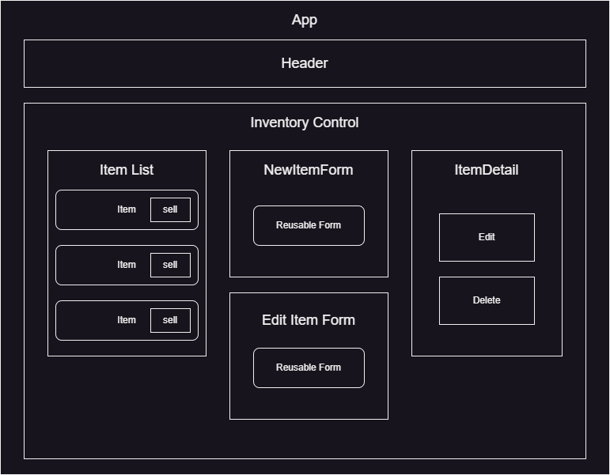

# _React Inventory Tracker_

#### By Noah Cowan, June 11, 2023

## Technologies Used
  - JavaScript
  - React.js
  - HTML/CSS
  - Node
  - Git
  - Github
  - developed in vscode

## Description
This is a mock application to track the current inventory in a store. The user can add, update, view, and delete inventory. The user can also sell stock of the inventory unit by unit. 

## Component Map

## Setup/Installation Requirements

* Clone the repository to your desktop.
* Navigate to the project's top directory in your terminal.
* enter `npm install` to install all dependencies
* to generate a bundled package of the project, enter `npm run build`
* to set up a development server, enter `npm run start`

## Known Bugs
None
***

## License

_MIT License

Copyright (c) [2023] [Noah Cowan]

Permission is hereby granted, free of charge, to any person obtaining a copy of this software and associated documentation files (the "Software"), to deal in the Software without restriction, including without limitation the rights to use, copy, modify, merge, publish, distribute, sublicense, and/or sell
copies of the Software, and to permit persons to whom the Software is furnished to do so, subject to the following conditions:

The above copyright notice and this permission notice shall be included in all copies or substantial portions of the Software.

THE SOFTWARE IS PROVIDED "AS IS", WITHOUT WARRANTY OF ANY KIND, EXPRESS OR IMPLIED, INCLUDING BUT NOT LIMITED TO THE WARRANTIES OF MERCHANTABILITY, FITNESS FOR A PARTICULAR PURPOSE AND NONINFRINGEMENT. IN NO EVENT SHALL THE AUTHORS OR COPYRIGHT HOLDERS BE LIABLE FOR ANY CLAIM, DAMAGES OR OTHER
LIABILITY, WHETHER IN AN ACTION OF CONTRACT, TORT OR OTHERWISE, ARISING FROM, OUT OF OR IN CONNECTION WITH THE SOFTWARE OR THE USE OR OTHER DEALINGS IN THE SOFTWARE._